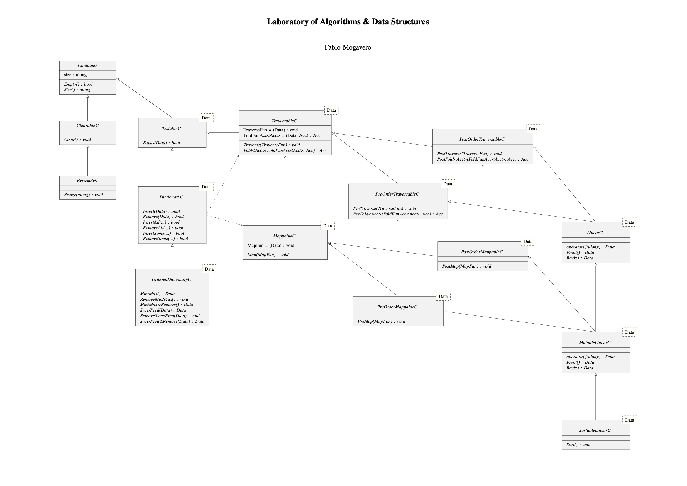
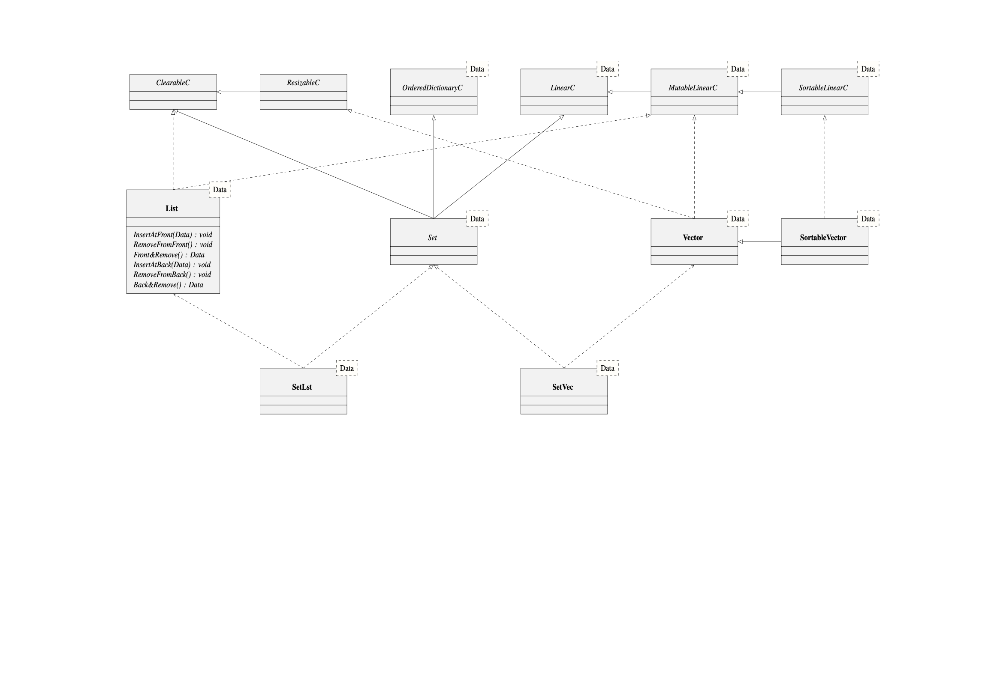

# Algorithms and Data Structures Laboratory

This repository contains the implementation of a modular and extensible library of containers and data structures, based on object-oriented principles and abstract interfaces. It follows the design specified by the official class diagram from Professor Fabio Mogavero’s course.

## Project Overview

The core of the project is a hierarchy of abstract container classes and their concrete implementations, supporting:

- Linear data structures (e.g. `List`, `Vector`)
- Sets (`SetLst`, `SetVec`)
- Traversal and mapping (pre-, post-order)
- Resizability, clearability, and testability
- Dictionary and ordered dictionary operations

## Class Structure Highlights

### Interfaces

- **Container**
  - `Empty()`, `Size()`
- **ClearableC**, **ResizableC**, **TestableC**
  - Reset or inspect containers
- **TraversableC** / **MappableC**
  - `Traverse`, `Fold`, `Map` using function callbacks
- **Pre/Post Order Traversal/MappableC**
  - Specialized traversal orders
- **DictionaryC**, **OrderedDictionaryC**
  - `Insert`, `Remove`, `Min`, `Max`, `Succ`, `Pred` operations
- **LinearC**, **MutableLinearC**, **SortableLinearC**
  - Indexed access, sortability, front/back access

### Implementations

- `List`: Doubly-linked list with front/back insert/remove
- `Vector`, `SortableVector`: Resizable arrays with sorting
- `SetLst`, `SetVec`: Set abstractions built on `List` and `Vector`

## Technologies

- Language: **C++**
- Paradigm: Object-Oriented Programming
- Tools: g++, Makefile, Valgrind (optional)

## How to Use

### Build

```bash
make
```

## Class Diagram


 
